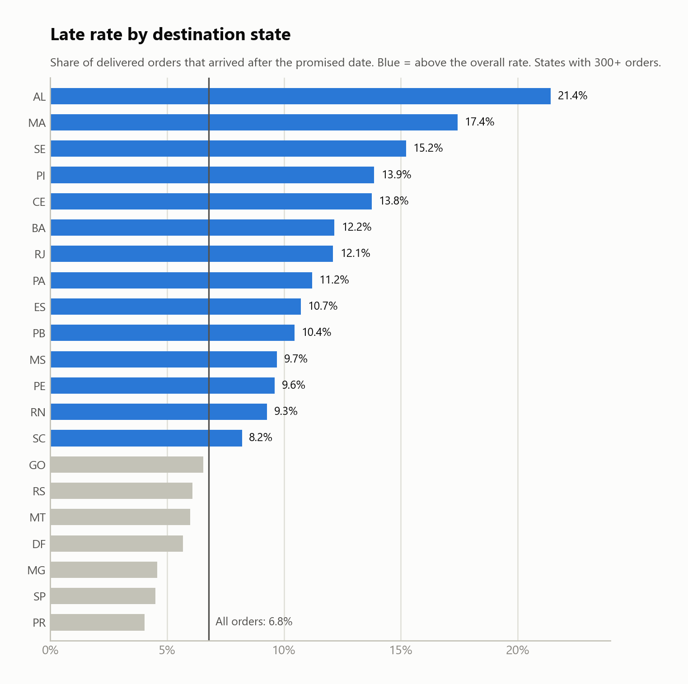
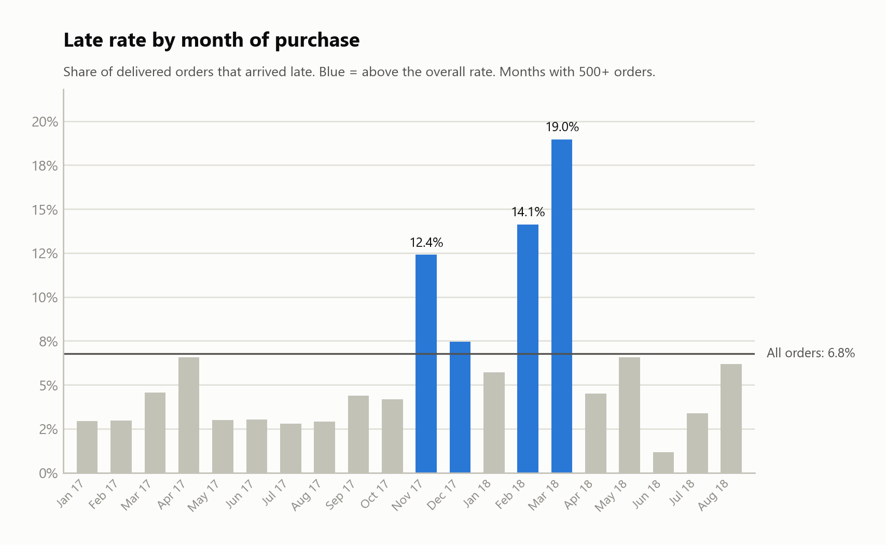
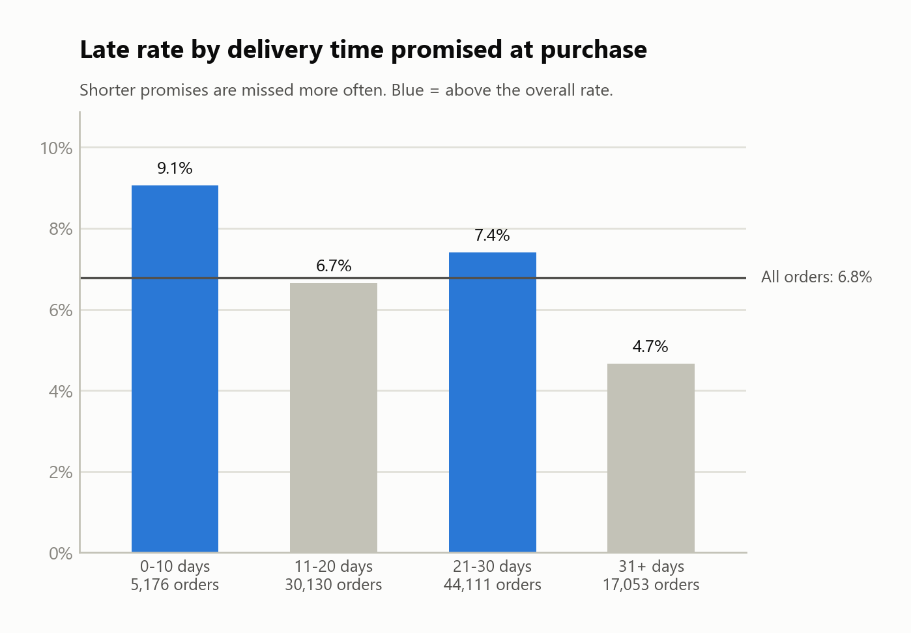
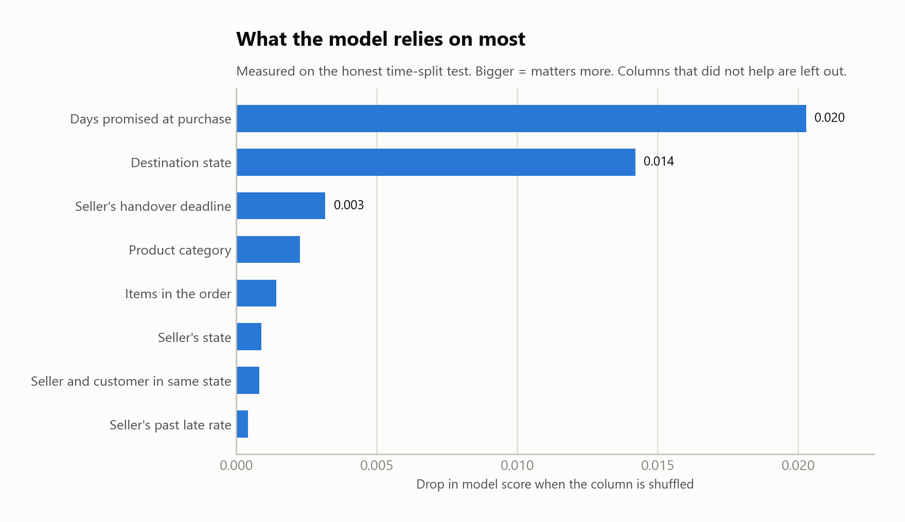

## Data credit

Dataset: "Brazilian E-Commerce Public Dataset by Olist" by Olist, published on Kaggle
(https://www.kaggle.com/datasets/olistbr/brazilian-ecommerce).
Licensed under CC BY-NC-SA 4.0 (https://creativecommons.org/licenses/by-nc-sa/4.0/).
The data is not included in this repository. This project is for learning and
portfolio use only and is not affiliated with Olist.

# Predicting late deliveries in Brazilian e-commerce (Olist)

Can we tell, at the moment a customer places an order, whether it will arrive after the promised date?
This project answers that with ~96,000 real delivered orders from the Olist marketplace.

## Headline result

- **6.8% of orders arrive late**, so "always predict on time" is already 93.2% accurate. Accuracy is therefore the wrong score; I use ROC AUC, average precision and a "flag the riskiest 10%" test instead.
- On an honest **time-split test** (train on orders before April 2018, test on orders after), the model reaches **ROC AUC 0.651**.
- Flagging the riskiest 10% of orders catches **about 24% of all late orders** (a random flag would catch 10%). Roughly 9 in 10 flagged orders are still not late.
- Conclusion: information available at order time carries real but **modest** signal. Lateness is largely driven by events after the order (carrier problems, demand spikes), which this data cannot see.

## Charts






## Data

[Brazilian E-Commerce Public Dataset by Olist](https://www.kaggle.com/datasets/olistbr/brazilian-ecommerce) on Kaggle.
Not included in this repo (large). Download it, unzip the CSVs into a `data/` folder.
Check the licence and attribution requirements on the Kaggle page before reuse.

## Approach

1. **`build_deliveries.py`** joins orders, items, customers, sellers, products, category names and geolocation into one row per delivered order. Target `is_late` = delivered after the promised date. Distance is the straight-line km between seller and customer zip-code centres.
2. **`explore.py`** prints late rates by state, category, weight, month and promised window.
3. **`train_model.py`** trains a gradient-boosting classifier (scikit-learn `HistGradientBoostingClassifier`).
4. **`make_charts.py`** draws the charts above from the saved results.

### Avoiding cheating (data leakage)
- Actual delivery date and delay are never used as inputs: they *are* the answer.
- Seller ID is not used (thousands of sellers, many with a handful of orders: the model would memorise names).
- A seller's track record counts only deliveries finished **before** the order was placed.

### Honest evaluation
- **Test A**: random 80/20 split (optimistic).
- **Test B**: train on the past, test on the future (what real use looks like). This is the score to trust.

Exact numbers for both tests are in `results/metrics.csv` after running the model.

## Findings
- Strongest signals: **days promised at purchase** and **destination state**. Shorter promises are missed more often.
- The seller's handover deadline is a small third signal.
- Distance and seller history added almost nothing once state was known. Likely because state already captures distance; I did not prove this.
- Lateness comes in bursts (Nov 2017, Feb–Mar 2018). The data does not explain why.

## Limitations
- Modest predictive power; not ready to run a real operation on its own.
- Only delivered orders are included; cancelled or lost orders are invisible.
- One marketplace, about two years of data.
- Distance is straight-line, not road distance.

## Run it
```
python -m pip install -r requirements.txt
python build_deliveries.py
python explore.py
python train_model.py
python make_charts.py
```
